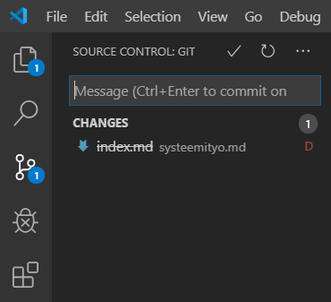
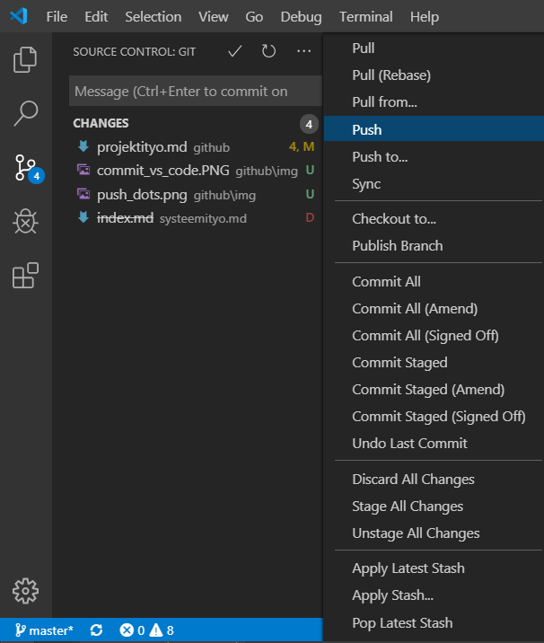
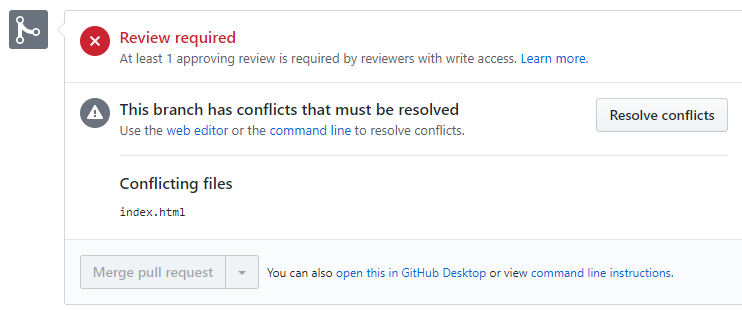
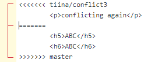

## Projektissa työskentely

### Repon luominen, jakaminen ja suojaaminen

Yksi projektiryhmän jäsenistä tekee tyhjän github-repon, antaa muille yhteistyöoikeudet (*collaboration*) sekä muuttaa asetukset (*settings -> branches*) muotoon *Protect matching branches/Require pull request reviews before merging*, kirjoita *Branch matching rule*-kohtaan *master* ja valitse *Include administrators*.

Tämä pakottaa sen, että koodi katselmoidaan ennen sen lisäämistä *master*-haaraan.

Kukin projektiryhmän jäsen kloonaa tehtdyn repon itselleen:

```bash
git clone <your_github_repo.git>
```

### Haaran luominen (*branch*)

Joka kerta kun koodaat uutta ominaisuutta, tee uusi github-branch. Aloita tekemällä *checkout* *master*-haaralle ja *pull* siihen, että saat uusimmat muutokset *master*-koodista omalle koneellesi.

```bash
git checkout master
git pull
git checkout -b <your_name>/<your_feature>
```

Kun toiminnallisuus on valmis, päivitä muutokset *github*:iin (add/commit/push). Jotta *push* toimii tee uusi *upstream*-haara *github*:iin:

```bash
git push --set-upstream <your_name>/<your_feature>
```

Voit tehdä *commit*:in myös suoraan *VSCode*-ohjelmassa. Silloin ei tarvitse tehdä *add*-vaihetta käsin (lisäys hoituu automaattisesti). Samoin *upstream*-syntyy automaattisesti.

    1. Aloita valitsemalla vasemmalta versionhallinta (kolmas ylhäältä). 

    2. Kirjoita *commit*-viesti kenttään ja valitse *ok* tai *Ctrl+Enter*. Vastaa *yes* kun kysytään lisätäänkö kaikki muutokset.



    3. Tee vielä *Push* (avaa valikko kolmesta pisteestä):



    4. Vastaa *yes* kun kysytään tehdäänkö *upstream*.
    
### Pull request:in tekeminen

Mene *github*:iin kohtaa *Pull requests* ja tee uusi sellainen. Jonkun toisen täytyy katselmoida koodi, sekä hyväksyä se (*Accept*). Käy vielä tekemässä *Merge*. Kun katselmoit toisen koodia, muutokset näkyvät ruudulla (vihreät ovat lisäyksi, punaiset positoja).

### Merge conflict

Jos kaksi henkilöä muuttaa samaan aikaan saman tiedoston samaa riviä, syntyy *merge*-vaiheessa *merge conflict*. Huomaat tämän jo siinä vaiheessa kun tee *Pull request*:ia* *github*:ssa punaisena tekstinä (*Can't automatically merge*).


Voit silti tehdä *Pull request*:in. Tässä vaihessa joko sinä itse tai joku muu samassa projektissa ratkaisee miten tiedoston muutokset käsitellään (*resolve conflicts*).



Tämä tehdään käsin poistamalla turhat koodirivit, sekä editorin lisäämät merkit <<<<< ===== >>>>>, jotka auttavat näkemään missä muutokset ovat. Tee vielä *commit*. Jos teit tämän itse, toisen projektihenkilön pitää se hyväksyä.

