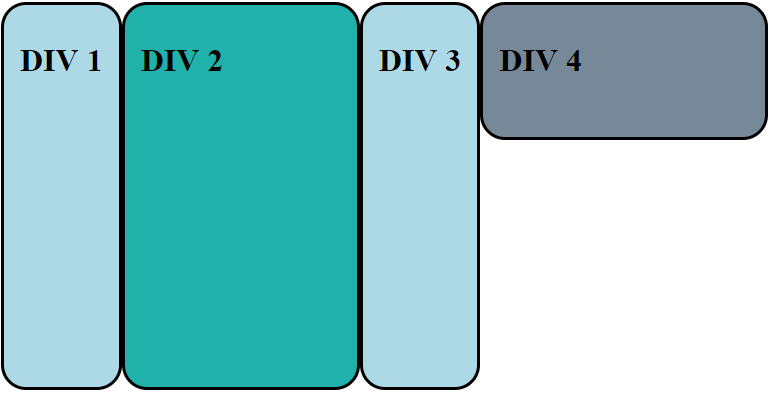

## CSS demo 2

### Flexbox

*Flexbox*:in avulla voidaan asetella elementtejä sivulle tai toisen elementin sisällä. Elementtiä, joka sisältää toisia elementtejä, kutsutaan *flex container*:iksi. Sen sisällä on *flex item*:eja.

Periaatteessa riittää, että *flex container*:lle määritellään:

```css
.main {
    display: flex;
}
```

Tämän jälkeen kaikki sen lapset ovat automaattisesti *flex-item*:eja.

### Alkutoimet

Tallenna seuraava koodi *css-demo2.html*-tiedostoon:

```html
<!DOCTYPE html>
<html>
    <head>
        <meta charset="UTF-8">
        <title>Flexbox-harjoitus</title>
        <link rel="stylesheet" href="boxit.css">
    </head>
    <body>
        <div class="main">
        <div class="subdiv">
            <h1>DIV 1</h1>
        </div>
        <div class="subdiv highdiv">
            <h1>DIV 2</h1>
        </div>
        <div class="subdiv">
            <h1>DIV 3</h1>
        </div>
        <div class="subdiv widediv">
            <h1>DIV 4</h1>
        </div>
    </div>
    </body>
</html>
```

Tallenna seuraava koodi *boxit.css* -tiedostoon. *flex-container* on *div*, jonka luokka on *main* ja sen sisällä on *flex-item*:ejä, joiden luokka on *subdiv*. Yksi *subdiv*:estä kuuluu lisäksi luokkaan *highdiv* tai toinen *widediv*.

```css
.main {
    display: flex;
}

.subdiv {
    height: auto;
    width: auto;
    padding: 1em;
    border-style: solid;
    border-width: 3px;
    border-radius: 25px;
    background-color: lightblue;
}

.highdiv {
    height: 350px;
    width: 200px;
    background-color: lightseagreen;
}

.widediv {
    height: 100px;
    width: 250px;
    background-color: lightslategray;
}
```

Sivu näyttää aluksi tältä:



### Laatikoiden järjestys (*item*)

Normaalisti *div*:it luodaan sivulle siinä järjestyksessä kun ne ovat HTML-tiedostossa. Järjestykseen voi kuitenkin vaikuttaa *order*:in avulla. Oletusarvo järjestykselle on 0, joten -1 tuo *flex-item*:in alkuun, 2 vie sen loppuun jne.

```css
order: -1;
```

### Laatikoiden asettelu sivulle (*container*)

Oletusarvoidesti *flex-item*:it sijoitetaan sivulle vaakaan. Jos haluat ne pystyriviin sen voi tehdä näin:

```css
    flex-direction: column;
```

Jos *flex-item*:ien toivotaan siirtyvän uudelle riville selainikkunan kaventuessa, aktivoi *flex-wrap*:

```css
    flex-wrap: wrap;
```

Jos laatikot halutaan alkamaan vasemmalta tai oikealta reunalta, tai ne halutaan vaakasuunnassa keskelle, käytetään *justify-content*-asetusta:

```css
justify-content: center;
justify-content: flex-end;
```

Pystysuunnassa samat asetukset saadaan aikaan *align-items*:illa.

```css
align-items: flex-start;
```

### Laatikoiden koko (*item*)

Jos *flex-item*:in leveyttä tai korkeutta ei ole määritelty, se skaalautuu automaattisesti sisältönsä mukaisesti sopivan kokoiseksi. Tässä esimerkissä tällaisia vapaasti skaalautuvia *flex-item*:eitä ovat *DIV1* ja *DIV3*. Jos halutaan, että *flex-item* täyttää kaiken vapaana olevan tilan voidaan niille määritellä *flex-grow*. Kokeile asettaa kaikille *sub-div*:eille:

```css
    flex-grow: 1;
```

Laatikot voivat kasvaa myös suhteessa nopeammin kuin muut laatikot. Aseta yhdelle *high-div*:lle:

```css
flex-grow: 2;
```

[Lue lisää flex-box:ista](https://css-tricks.com/snippets/css/a-guide-to-flexbox/))