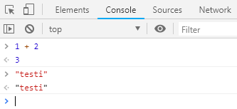

## JavaScript alkeita

### JavaScriptin ajaminen

JavaScript:in ajaminen vaatii joko selaimen tai [node.js](https://nodejs.org/en/):n. Molemmista löytyy REPL eli *Read Eval Print Loop*. REPL:in promptiin voi kirjoitaa JavaScript-lausekkeita, painaa *enter*:iä ja katsoa mitä koodi tekee. 

Seuraavat harjoituksia voit ajaa joko node:lla tai selaimessa:
1. Node:
  Käynnistä node.js Windows-valikosta tai CMD:n kautta kirjoittamalla "node".
2. Selain (Chrome):
  Avaa selaimen kehittäjänäkymä **Ctrl+Shift+J**

Kokeile kirjoittaa nyt auenneeseen promptiin:

```js
1 + 2
"testi"
```



### Tietotyypit

JavaScriptin perustietotyypit ovat:

| Tietotyyppi    | Esimerkkejä      | 
| ------------- |:-------------:| 
| luku (number)      | ```35 2e3 -4.9 ``` | 
| merkkijono (string)      | ```"koira" 'kissa' ```     |  
| totuusarvo (boolean) | ```true false ``` |
| määrittelemätön/tuntematon | ```undefined null``` |

### Muuttujat

Muuttuja on nimetty tiedon tallennuspaikka. Ennen muuttujan käyttämistä, se täytyy alustaa antamalla sille alkuarvo. Kun muuttuja alustetaan, sen tyyppiä ei tarvitse kertoa, muuttujan tyyppi voi myös muuttua ohjelman suorituksen aikana eli JS on ns. *dynaamisesti tyypitetty* kieli.

*var*:in avulla määritellään muuttuja, joka näkyy kaikkialla ohjelmakoodissa:
```js
var name = "Oma JS-ohjelmani";
```
*let*:in avulla määritellään muuttuja, joka näkyy vain ko. ohjelmalohkon sisällä.
```js
let number = 123456;
```
*const*:in avulla määritellään vakio, muuttuja jonka arvon ei haluta muuttuvan:
```js
const info = "Soita 112";
```
*let* ja *const* eivät anna määritellä kahta samannimistä muuttujaa.

### Aritmeettiset operaattorit

Aritmeettiset operaattorit operoivat luvuilla:

| Operaattori    | Esimerkkejä    | 
| --------------------- |:-------------:| 
| + (yhteenlasku) | ```4 + 5 ``` | 
| - (vähennyslasku) | ```4.5 - 3.1 ``` |
| * (kertolasku)| ```90 * 0.23``` |
| / (jakolasku) | ```3 / 20``` |
| ** (potenssiin korotus) | ``` 2 ** 10``` |
| % (modulo, jakojäännös) | ``` 10 % 6``` |

Laskujärjestys ilmoitetaan sulkujen avulla:
```js
(20 + 3)/(14 - 2)
```
**Huom!**
JavaScript tekee automaattisia tyyppimuunnoksia, joten jos et ole varuillasi laskulausekkeet eivät toimi kuten voisi kuvitella. Kokeile seuraavia:

```js
20 + "3"
```

Tässä molemmat muunnetaan merkkijonoiksi eli käytännössä käykin näin:

```js
"20" + "3"
```

Mutta jos kokeilet kertolaskua merkkijonoilla (ei pitäisi toimia):

```js
"20" * "3"
```

Tässä molemmat muunnetaankin luvuiksi eli käytännössä käykin näin:

```js
20 * 3
```

Ikäviä yllätyksiä voi välttää muuntamalla tyypin itse tarkoittamakseen, esim. merkkijono muunnetaan luvuksi näin:

```js
Number("3")
```

Luku muunnetaan merkkinoksi näin:

```js
String(3)
```

Ja muuttujan tyypin voi kysyä näin:

```js
typeof(info)
```

Joskus tyyppimuunnosta ei voi tehdä, silloin palautu *NaN* (Not a Number):

```js
Number("kolme") + 10
```

### Merkkijonot

Pidempiä merkkijonoja voidaan muodostaan yhdistelemällä lyhyempiä. Lausekkeessa voi olla mukana muuttujia sekä lukuja. Usein merkkijonoja tulostetaan konsolille:

```js
console.log("Tämän ohjelman nimi on: " + name);
```

Selaimessa toimii myös alert-ikkuna (ei toimi node.js:n kanssa):

```js
alert('Soita numeroon ' + number);
```

Merkkijonon pituuden saat selville *length*:in avulla:

```js
info.length
```

### Vertailoperaattori

Ehtolauseissa käytetään usein vertailuoperaattoreita. Vertailuoperaatio palauttaa totuusarvon (true/false):

| Vertailuoperaattori    | Esimerkkejä      | 
| ---------------------- |:-------------:| 
| < (pienempi kuin)   | ``` 2 < 2``` | 
| > (suurempi kuin)     | ``` -1 > 0 ```     |  
| <= (pienempi tai yhtäsuuri kuin)   | ``` 20 <= 2``` | 
| >= (suurempi tai yhtäsuuri kuin)     | ``` -1 >= -1 ```     | 
| == (yhtäsuuri)| ```90 == "90"``` |
| === (yhtäsuuri ja samaa tyyppiä) | ```90 === 900/10``` |
| != (erisuuri) | ``` 2 != 10``` |


### Ehtolause

JavaScriptissä on kaksi tapaa tehdä ehtolause. Jos ehto on lyhyt sen voi kirjoittaa näin:

```js
let a = 10;
let b = 9;
a > b ? "kissa" : "koira";
```

Tässä alustettiin ensin muuttujat a ja b. Jos vertailu a > b saa arvon *true*, palautuu "kissa" muuten "koira.

Jos tosihaarassa pitää suorittaa enemmän koodia, on parempi käytää if-else-rakennetta (aaltosulkujen sisään voi laittaa useita rivejä koodia ns. koodilohko):
```js
if(a > b){
  "kissa"
  } else {
    "koira"
    }
```

### Funktio

Funktioiden avulla voidaan kirjoittaa modulaarista ohjelmakoodia, jakaa toiminnallisuus pieniin helposti testattaviin paloihin. *Puhdas funktio* saa sisäänsä tietoa parametrien välityksellä (*input*) ja se palauttaa *return* aina yhden arvon (*output*). JavaScriptissä kaikki funktiot eivät aina saa parametreja eivätkä ne aina palauta paluuarvoa, joten ne eivät ole ns. puhtaita funktioita.

Funktion voi määritellä JavaScriptissä kolmella eri tavalla:

```js
function summa(x , y){
  return x + y;
}
```

Tämä määrittelee funktion, mutta antaa mahdollisuuden muuttaa funktion määritelmää myöhemmin.

```js
const summa = function(x , y){
  return x + y;
}
```

*const*:in avulla määriteltyä funktiota ei pysty muuttamaan myöhemmin (turvallisempi).

```js
const summa = (x , y) => {
  return x + y;
}
```

Viimeisenä on lyhyin ns. nuolifunktio. Jos funktion koodi mahtuu yhdelle riville, nuolifunktion voi kirjoitta vieläkin lyhyemmin:

```js
const summa = (x , y) => x + y;
```
