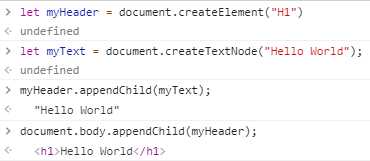

## Document Object Model (DOM)

Palautetaan mieleen, että DOM on puumainen rakenne, jossa *textNode*:t roikkuvat *element*:eissä.


### DOM-demo 2: jatko

<iframe width="640" height="360" src="https://web.microsoftstream.com/embed/video/82a90967-db82-4e78-9288-62c9db954415?autoplay=false&amp;showinfo=true" allowfullscreen style="border:none;"></iframe>

#### Elementtien luominen

Koko HTML-dokumentin voi rakentaa käyttämällä JavaScriptiä. Aloitetaan siis lähes puhtaalta pöydältä, tallenna tämä tiedostoon *domdemo2.html*, ja avaa se selaimeen (tähän HTML-tiedostoon ei tehdä tämän jälkeen enää muutoksia):

```html
<!DOCTYPE html>
<html>
<head>
    <meta charset="UTF-8">
    <title>DOM demo2: jatko</title>
</head>
<body>
  <h1>Harjoitellaan elementtien lisäämistä</h1>
  <ul id="namelist"></ul>
  <script src="domdemo2.js"></script>
</body>
</html>
```

Tee myös uusi JavaScript-tiedosto, *domdemo2.js*. Nyt luodaan JavaScript:in avulla uusi h1-elementti, ja sen tekstiä varten oma *textnode*.

### Elementin ja tekstinoden luominen ja liittäminen sivulle

```js
let myHeader = document.createElement("h1")
let myText = document.createTextNode("Hello World");
```

Liitätään tekstiä sisältävä *node* h1-elementin lapseksi, ja koko paketti body-elementin lapseksi:

```js
myHeader.appendChild(myText);
document.body.appendChild(myHeader);
```

Tutki miltä DOM-puu näyttää nyt (selaimen *elements*) . Sivulle ei tule uutta tekstiä näkyviin ennen kuin lapsielementit on liitetty *body*-elementtiin.



Jos haluat vielä muuttaa tekstiä (*Hello World*), se onnistuu näin (muuttujassa myText on tallessa luomamme *TextNode*):

```js
myText.textContent = "Ihan parasta!";
```

Huom. *textContent* toimii sekä *element*:lle että *textNode*:lle. Tämä toimii vain *textNode*:lle:

```js
myText.nodeValue = "Toimii vain textNodelle";
```

#### Elementtien luominen silmukassa

Usein pitää tehdä monta elementtiä eikä voida tietää etukäteen kuinka monta (esim. tietokannassa voi olla monta tietuetta).

Tehdään ensin funktio, joka luo yhden halutun kaltaisen elementin:

```js
function listItem(listText, parentElem){
  let myItem = document.createElement("li")
  let myText = document.createTextNode(listText);
  myItem.appendChild(myText);
  parentElem.appendChild(myItem);
}
```

Tehdään lista jossa on halutut tekstit (myList), haetaan HTML-dokumentista kohta johon halutaan lisätä uusia elementtejä (myElem), ja kutsutaan *listItem*-funktiota silmukassa (forEach):

```js
let names = ["Tiina", "Janne", "Juuso", "Sirkka"];

let myElem = document.getElementById("namelist");
let myList = document.createElement("ul")

names.forEach(name => {
  listItem(name, myList);
})
```

### Elementtien luominen silmukassa (toinen tapa)

```js
function newTextElem(text, type){
    let myElem = document.createElement(type)
    myElem.textContent = text;
    return myElem
  }
```

Tehdään lista jossa on halutut tekstit (myList), haetaan HTML-dokumentista kohta johon halutaan lisätä uusia elementtejä (myElem), ja kutsutaan *newTextElem*-funktiota silmukassa (forEach) ja lisätään luodut elementit sivulle (*appendChild*):

```js
let names = ["Tiina", "Janne", "Juuso", "Sirkka"];

let myDiv = document.getElementById("namelist");
let myList = document.createElement("ul")
myDiv.appendChild(myList)

names.forEach(name => {
  let myElem = newTextElem(name, "li");
  myList.appendChild(myElem);
})
```

### Hyödyllisiä vinkkejä

Elementille voi lisätä luokan:

```js
nameElem.classList.add("alert");
```

- lapsen lisääminen [AppendChild](https://www.w3schools.com/jsref/met_node_appendchild.asp)
- lapsen lisääminen väliin [InsertBefore](https://www.w3schools.com/jsref/met_node_insertbefore.asp)
