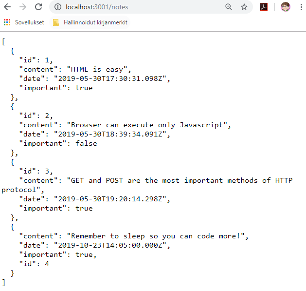

## Notes-demo osa 2

### Alkutoimet

- Käynnistä *json-server* ellei se ole jo käynnissä (käynnistys *backend*-kansiossa)

- Tallenna backend:in osoite muuttujaan, ja käytä sitä tästä eteenpäin *axios*-kutsuissa:

```js
const baseURL = 'http://localhost:3001/notes';
```

### Tehtävä 3: uuden (kovakoodatun) muistiinpanon lähettäminen backendille

Lähetä axioksen avulla backend:ille uusi, aluksi kovakoodattu, muistiinpano (*note*-olio). Tee uusi funktio *addNote*, ja liitä se "lisää muistiinpano" -nappiin.

```js
  const addNote = () => {
    const note = {content: "uusi viesti", 
                  date: new Date().toISOString(), important: false};
    axios.post(baseURL, note).then(response => {
      console.log(response.data)
    })
  }
```

Lisää tämä *App.js*:n return:in sisälle:

```jsx
<button onClick={addNote}>Lisää kovakoodattu muistiinpano</button>
```

Paina napista ja katso konsolilta, mitä backend palautti. Katso myös, että uusi muistiinpano tallentui json-serverille (*db.json*).

*Huom* id-tulee serveriltä, älä lähetä sitä.



### Tehtävä 4: lomake ja submitHandler

Tee lomakekomponentti, jonka avulla saadaan syötettyä uusi muistiinpano, sekä valittua sen tärkeys (true/false) *check-box*:in avulla. Tallenna lomakekentät tilamuuttujiin ja lähetä syötetyt tiedot *notes-backend*:ille, kun lomake *submit*:oidaan.

```js
import { useState } from "react";

const NotesForm = ({submitHandler}) => {
    const [newNote, setNewNote] = useState("");
    const [newImportance, setNewImportance] = useState(false);
    return(
        <form onSubmit={e=> submitHandler(e, newNote, newImportance)}>
            Muistiinpano:
            <input onChange={e=>setNewNote(e.target.value)} 
                   name="note" 
                   value={newNote} 
                   type="text" />
                           
            Tärkeä?
            <input onChange={e=>setNewImportance(!newImportance)} 
                   type="checkbox" 
                   name="importance" 
                   checked={newImportance}/>
            <input type="submit" value="tallenna" />
        </form>
    )
}

export default NotesForm;
```

Ota komponentti käyttöön *App.js*:ssä ja välitä sille *addNote*-funktio, joka toimii *submitHandler*:nä:

```jsx
   <NotesForm submitHandler={addNote}/>
```

Muokkaa nyt *addNote*-funktiota niin, että se ottaa kolme parametria (ks. koodi yllä), ja lähettää ne backend:ille (kovakoodattujen tilalla). Funktion alussa pitää muistaa kutsua *event.preventDefault()*, jotta sivua ei lähdetä uudelleen lataamaan (kuten PHP:ssä).

Nyt muutokset näkyvät backend:issä, mutta sivu pitää päivittää että uusi muistiinpano näkyy myös ruudulla. Asian voi korjata lisäämällä *backend*:in takaisin lähettämä *note* tilamuuttujaan (*then*:in sisällä):

```js
 setNotes(notes.concat(response.data))
 ```

Nyt uusi muistiinpano ilmestyy ruudulle automaattisesti.

Tehtävä: tyhjennä lomakkeen kentät muistiinpanon lisäämisen jälkeen

### Tehtävä 5: Muistiinpanon poistaminen

Lisää jokaiselle muistiinpanolle poistonappi *notes*-komponenttiin (map:in sisälle):

```jsx
<button onClick={e=>deleteHandler(e, note.id)}>Poista</button>
```

Määrittele *Apps.js*:ssä *deleteNote*-funktio ja välitä se *props*:ina *Notes*-komponentille:

```js
const deleteNote = (e, id) => {
    axios.delete(`${baseURL}/${id}`)
    .then(reponse => {
      console.log("poistettu:", id)
    })
  }
```

Tämä poistaa muistiinpanon, mutta ruudulla ei näy mitään ennen sivun päivittämistä. Lisätään tilamuuttujan päivitys (*then*:in sisälle), niin ruutukin päivittyy automaattisesti (filter poistaa poistetun muistiinpanon myös tilamuuttujasta):

```js
      setNotes(notes.filter(note => note.id !== id))
```

### Tehtävä 6: Muistiinpanon tärkeyden muuttaminen

Lisää myös toiminnallisuus, jolla voi muuttaa muistiinpanon tärkeyttä klikkaamalla sitä.

```jsx
 <li onClick={e=>updateHandler(e, note.id)}> {note.content} </li>
```

```js
const changeImportance = (e, id) => {
    // etsitään id:n perusteella oikea note:
    const tempNote = notes.find(note => note.id === id)
    // muutetaan sen tärkeys päinvastaiseksi:
    tempNote.important = !tempNote.important 
    // tallennetaan axioksen kautta backendille:
    axios.put(`${baseURL}/${id}`, tempNote)
    .then(response => {
      console.log("muutettu")
      })
  }
```

Mitään ei taaskaan näy ruudulla, vaikka pyyntö menee backend:ille. Lisää (*then*:in sisään) tilamuuttujan päivitys:

```js
      // etsitään vanha muistiinpano ja korvataan se uudella:
      const tempNotes = notes.map(note => {
        if(note.id === id)
          note = tempNote
          return note
        })
      // tallennetaan muutokset tilamuuttujaan:
      setNotes(tempNotes)
```

### Lisätehtävä 1

Tee *dropdown*-valikko, jonka avulla filteröit ruudulle näkyviin vain tärkeät muistiinpanot.

### Lisätehtävä 2

Siirrä *axios*:seen liittyvät kutsut omaan tiedostoonsa (koodi [täällä](./axios-service.html)). Ota em. service käyttöön *App.js*:ssä. Koodissa käytetään asynkronisiin kutsuihin *async/await* - rakennetta. Se vastaa täysin *then*-rakennetta.

[Ohjeet axios:en käyttöön löytyvät täältä (Axios ja promiset):](https://fullstackopen.com/osa2/palvelimella_olevan_datan_hakeminen)

---

---> [Notesdemo, osa 3](./notesdemo_osa3.html)