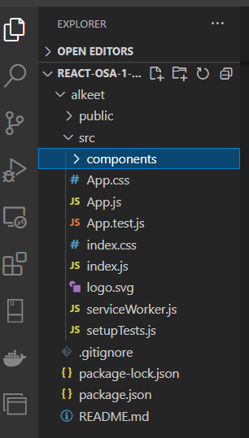

## React demo 1

### React-ympäristön käynnistäminen

Kloonaa *github-classroom* - repo ja siirry sen sisälle.
Tee uusi React-sovellus ajamalla create-react-app consolilla:

```cmd
> cd c:/users/oma.nimi/documents/react/
> npx create-react-app alkeet
```

Tämä komento luo React-projektin kansioon alkeet. Siirry kansion sisään ja käynnistä react:in *development server*. 

```cmd
> cd alkeet
> npm start
```

Nyt voit kirjoittaa react-koodia ja tehdyt muutokset näkyvät automaattisesti selaimessa (serveri ajaa *build*:in automaattisesti kun tiedostoja tallennetaan).

Kaikki koodi sijaitsee kansiossa *src* (source). Uudet komponentit kannattaa tehdä kansioon *components* (luo sellainen kansion *src* sisälle):



Ohjelmasi pääkomponentti on määritelty tiedostossa *App.js* ja tyylitiedosto on *App.css*. Muokkaa pääkomponentti *App* - seuraavasti:

```jsx
const App = () => {
  return (
    <div className="App">
      <header className="App-header">
      <h1>React alkeet demoja</h1>
      </header>
    </div>
  )
}
```

*App* on periaatteessa tavallinen JavaScript-nuolifunktio, kuitenkin niin että siinä on pakollinen (sulkujen sisälle kirjoitettava) *return*-osa, jonka pitää palauttaa yksi *HTML*-elementti (tässä *DIV*).

HUOM! React:issa komponentti - funktion nimen pitää alkaa isolla alkukirjaimella (*App* EI *app*).

Muokkaa myös *css*:ää (pienennä header:in korkeutta):

```css
.App-header {
  min-height: 20vh;
}
```

### React-muuttujat

React on JavaScript:iä, joten muutujat määritellään kuten JavaScriptissä (*const* tai *let*). Jos JS-muuttujaan tai JS-funktioon viitataan *return*:in sisällä (JSX-syntaksi), koodin ympärille laitetaan aaltosulut *{ }*.

```jsx
const App = () => {
  const name = "Tiina";
  const age = 49;
  return (
    <div className="App">
      <header className="App-header">
      <h1>React alkeet demoja</h1>
      </header>
    </div>
    <div>
        Hei, olen {name} ja olen {age}-vuotta.
    </div>
  )
}
```

### React-komponentti

Kaikki koodi React:issa sijaitsee jossakin komponentissa. Jotta pääkomponentti ei "räjähdä" (tule liian isoksi), uudet toiminnallisuudet kannattaa sijoittaa omiin komponentteihinsa omiin tiedostoihinsa. Komponentit otetaan käyttöön (*import*) pääkomponentissa *App*.

Tee uusi komponentti *CourseInfo* kansioon *components* (CourseInfo.js), joka tulostaa kurssitiedot.

```jsx
const CourseInfo = () => {
    const teacher = "Tiina Partanen";
    const course = "React";
    const classroom = "S2041";
    const material = "http://otredu.github.io"; 
    return (
        <div>
            <h1>{course}</h1>
            <p>Teacher: {teacher}</p>
            <a href={material}>Linkki materiaaliin</a>
        </div>
    )
}

export default CourseInfo;
```

Tuo komponentti *App*:iin (*import*) ja kutsu sitä *App*:n *return*:in sisältä. Vaikka React-komponentti on nuolifunktio, sitä ei kursuta kuin normaalia funktiota, syntaksi muistuttaa enemmän HTML:ää (\<CourseInfo \/>).

HUOM! Et voi käyttää *import*:ia ellei komponetin tiedostossa ole sitä vastaavaa *export*:ia (*export default*:ia käytetään kun halutaan exportata vain yksi komponetti).

```jsx
import CourseInfo from './components/CourseInfo.js';

const App = () => {

  return (
    <div className="App">
      <header className="App-header">
      <h1>React alkeet demoja</h1>
      </header>
    </div>
    <div>
       <CourseInfo />
    </div>
  )
}

```

### React-props:it

Nyt tehty komponetti ei ole kovin hyödyllinen, se tulostaa aina samat tiedot. Muutetaan sitä niin, että se ottaa sisäänsä parametreja eli React-kielellä *props*:eja. Tiedot välitetään komponentille *App*:issa. *Props*-koostuu sen nimestä esim. *teacher* ja arvosta joka sijoitetaan siihen *"Tiina Partanen"*.

```jsx
  <CourseInfo teacher = "Tiina Partanen"
              course = "React"
              classroom = "S2041"
              material = "http://otredu.github.io" />
```

Komponettia muutetaan niin, että se saa tarvitsemansa tiedot propseina:

```jsx
const CourseInfo = (props) => {
    return (
        <div>
            <h1>{props.course}</h1>
            <p>Teacher: {props.teacher}</p>
            <a href={props.material}>Linkki materiaaliin</a>
        </div>
    )
}
```

Koska *props*-on JS-olio, sen voi "räjäyttää auki" aaltosulkujen avulla eli käyttää *object destructuring*-notaatiota. Näin voi viitata suoraan propseihin ilman *props*-sanaa:

```jsx
const CourseInfo = ({course, teacher, material}) => {
    return (
        <div>
            <h1>{course}</h1>
            <p>Teacher: {teacher}</p>
            <a href={material}>Linkki materiaaliin</a>
        </div>
    )
}
```

### React ja css

CSS-muotoilut toimivat React:in kanssa normaalisti, ainoa ero HTML:ään on se että *class*:in tilalle pitää kirjoittaa *className*.

```jsx
<div className="demo1">
      <h1>{course}</h1>
</div>
```

### Jatka loppuun itse:

1. Käytä nyt tehtyä komponenttia tulostamaan kaksi kurssia eri props:ien arvoilla.

2. Lisää css-tiedostoon muotoilut *demo1*-luokalle (ks. tehtävässä oleva kuva)
