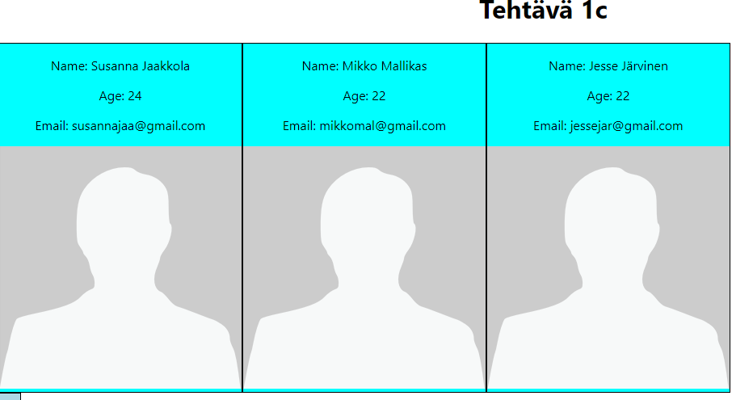
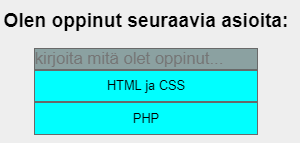

## Harjoitukset 1

---
## Demot 1 ja 2:

Opiskele React-perusasiat ensin joko opettajan johdolla tai tee nämä demot 1 ja 2:

- [React demo 1](./demot/reactdemo_osa1.md)
- [React demo 2](./demot/reactdemo_osa2.md)
### React demo 1 tehtävänanto

Tee komponentti, joka tulostaa ruudulle parametreina (props) annetut tiedot. Kutsu komponenttia kaksi kertaa eri tiedoilla. Muotoile näyttämään tältä:

### React demo 2, tehtävänanto

Toteuta sama toiminallisuus kuin demo1:ssa mutta käytä parametreina olioita, taulukoita sekä silmukkaa (map).

---
## Tehtävät (demojen 1 ja 2 jälkeen):
### Tehtävä 1a

Tee komponentti, joka tulostaa ruudulle parametreina (props) annetun opiskelija-olion tiedot. Kutsu komponenttia kerran, että näet että se toimii. Voit käyttää opiskelijan kuvana placeholder:ia (url).

### Tehtävä 1b

Tee komponentti, joka tulostaa ruudulle parametrina (props) annetun olioita sisältävän taulukon tiedot. Tämä tehdään käyttämällä tehtävän 1b komponenttia ja map:ia.

### Tehtävä 2 

Tee komponentti, joka tulostaa ruudulle taulukon muodossa parametrina annetun listan (array) kurssiolioita.

Vinkki: tee alikomponentti, joka tekee yhden rivin ja kutsu sitä map:in avulla.

### Tehtävä 3

Lisää sivulle kuvia, kuvatekstejä sekä kuvan otsikkoja. Tallenna yhteen kuvaan liittyvät tiedot olioon esim. attribuutteihin: *imageurl*, *title* ja *description*. Tallenna kuvatietoja sisältävät oliot taulukkoon erilliseen tiedostoon.

Vinkki: Tee komponentti, joka näyttää yhden kuvan tiedot ja toinen komponentti, joka näyttää kaikkien kuvien tiedot (kutsuu ensimmäistä map:in avulla).

HUOM! Tämän tehtävän voi tehdä myös [maademon datalla](https://otredu.github.io/js/maademo.html).

---
## Demo 3 

---
## Tehtävät (demon 3 jälkeen)
### Tehtävä 4 (DEMO)

Lisää sivulle napit, joita painamalla tehtävä osion saa piiloon/näkyville.

Vinkki, tarvitset tässä tehtävässä tilamuuttujia (*useState*). Tarvitset myös callback-funktion, joka reagoi onClick-eventtiin. Tilamuuttujat voi alustaa joko *app.js*-tasolla tai komponenteissa.

### Tehtävä 5 (harjoitus)

Lisää tehtävään 3 toiminnallisuus, että ensin näytetään vain kuvan otsikko ja otsikkoa klikkaamalla näytetään kuva ja kuvateksti. Otsikkoa uudelleenklikkaamalla ne piilotetetaan.

### Tehtävä 6 (DEMO)

Tee komponentti, joka tulostaa ruudulle alekkain parametrina annetut taidot (array). Sijoita ylimmäiseksi input-kenttä, jonka avulla voi lisätä uuden taidon listaan viimeiseksi.

Vinkki, tarvitset useamman tilamuuttujan (*useState*). Yhteen tallennetaan kaikki *skills*-tiedot, toiseen tallennetaan ruudulla oleva *newSkill*. Tarvitset myös callback-funktiot näiden molempien muokkaamiseen (onChange- ja onSubmit-eventtien käsittelyn yhteyteen). Tässä tehtävässä kannattanee pitää tilamuuttujat *app.js*-tasolla ja välittää ne propseina komponenteille.

### Tehtävä 7a (DEMO)

Tee lomake, jonka avulla voit lisätä sivulle linkkejä ja niiden kuvauksia. Käytä tilamuuttujana oliota, jossa on kentät jokaiselle lomakkeen kentälle. Luo uusi uniikki id, jokaiselle uudelle oliolle. Tee erillinen komponentti pelkälle lomakkeelle ja toinen komponentti, joka renderöi linkkilistan.

*Vinkki:* Voit luoda id:n luomalla isoja satunnaislukuja (Math.random).

*Vinkki:* Kun teet onChange - eventhandleriä, välitä sille parametrina tieto siitä, mikä kenttä on muuttunut (kentän nimi merkkijonona).

### Tehtävä 7b (DEMO)

Lisää jokaiselle linkille tykkäysnappi ja tallenna tykkäysten määrä tilamuuttujassa olevaan olioon (esim. kenttään "likes").

*Vinkki:* Käytä hyväksesi linkin uniikkia id:tä, että tiedät mitä linkkiä on tykätty (välitä id parametrina esim. addLike-funktiolle, joka lisää tykkäyksen oikeaan olioon tilamuuttujassa).

### Tehtävä 7c (DEMO)

Laske kaikkien linkkien saamat tykkäykset yhteen ja näytä ne sivulla.

*Vinkki:* Voit poimia tykkäysten määrät tilamuuttujasta map:in avulla ja laskea ne yhteen käyttäen reduce:a.

### Tehtävä 8 (harjoitus)

Muokkaa .css - tiedostoa, että elementit myös näyttävät hyvältä.

### Lisätehtävä 1 (harjoitus)

Tee nappi, joka järjestää linkit tykkäysten mukaiseen järjestykseen.

*Vinkki:* Käytä taulukon sort-metodia.

### Lisätehtävä 2 (harjoitus)

Tee komponentti joka näyttää maiden tiedot karusellissa. Tee nuolinapit joiden avulla voi selata maita yksi kerrallaan eteen- ja taaksepäin.

*Vinkki:* Käytä tilamuuttujaa, johon tallennat näytöllä näkyvän maan indeksin.

- [Tilamuuttujien käsittely](./immutable-state.html)