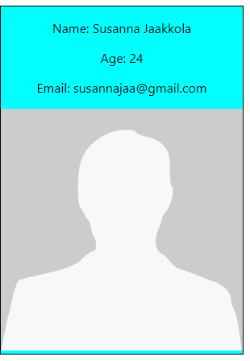

## Harjoitukset 1

### Demo 1

Tee uusi React-sovellus ajamalla create-react-app:

```cmd
> cd c:/users/oma.nimi/documents/react/
> npx create-react-app harj1
> cd harj1
> npm start
```

Tee uusi komponentti, joka tulostaa ruudulle ensimmäisellä tunnilla opitut uudet asiat ranskalaisina viivoina.

Muuta komponentti ottamaan sen sisältämät tiedot parametreina eli propseina. Välitä tiedot app-tasolta komponenttitasolle. Tuo opitutasiat taulukkomuodossa ja käytä map:ia.

### Tehtävä 1a (DEMO)

Tee komponentti, joka tulostaa ruudulle parametreina (props) annetut tiedot. Kutsu komponenttia kaksi kertaa eri tiedoilla.


### Tehtävä 1b (DEMO)

Tee komponentti, joka tulostaa ruudulle parametreina (props) annetun opiskelija-olion tiedot. Kutsu komponenttia kerran, että näet että se toimii. Voit käyttää opiskelijan kuvana placeholder:ia (url).



### Tehtävä 1c (DEMO)

Tee komponentti, joka tulostaa ruudulle parametrina (props) annetun olioita sisältävän taulukon tiedot. Tämä tehdään käyttämällä tehtävän 1b komponenttia ja map:ia.


### Tehtävä 2 (harjoitus)

Tee komponentti, joka tulostaa ruudulle taulukon muodossa parametrina annetun listan (array) kurssiolioita.

Vinkki: tee alikomponentti, joka tekee yhden rivin ja kutsu sitä map:in avulla.


### Tehtävä 3 (harjoitus)

Lisää sivulle kuvia, kuvatekstejä sekä kuvan otsikkoja. Tallenna yhteen kuvaan liittyvät tiedot olioon esim. attribuutteihin: *imageurl*, *title* ja *description*. Tallenna kuvatietoja sisältävät oliot taulukkoon erilliseen tiedostoon.

Vinkki: Tee komponentti, joka näyttää yhden kuvan tiedot ja toinen komponentti, joka näyttää kaikkien kuvien tiedot (kutsuu ensimmäistä map:in avulla).

HUOM! Tämän tehtävän voi tehdä myös [maademon datalla](https://otredu.github.io/js/maademo.html). 


### Tehtävä 4 (DEMO)

Lisää sivulle napit, joita painamalla tehtävä osion saa piiloon/näkyville.

Vinkki, tarvitset tässä tehtävässä tilamuuttujia (*useState*). Tarvitset myös callback-funktion, joka reagoi onClick-eventtiin. Tilamuuttujat voi alustaa joko *app.js*-tasolla tai komponenteissa.


### Tehtävä 5 (harjoitus)

Lisää tehtävään 3 toiminnallisuus, että ensin näytetään vain kuvan otsikko ja otsikkoa klikkaamalla näytetään kuva ja kuvateksti. Otsikkoa uudelleenklikkaamalla ne piilotetetaan.

### Tehtävä 6 (DEMO)

Tee komponentti, joka tulostaa ruudulle alekkain parametrina annetut taidot (array). Sijoita ylimmäiseksi input-kenttä, jonka avulla voi lisätä uuden taidon listaan viimeiseksi.


Vinkki, tarvitset useamman tilamuuttujan (*useState*). Yhteen tallennetaan kaikki *skills*-tiedot, toiseen tallennetaan ruudulla oleva *newSkill*. Tarvitset myös callback-funktiot näiden molempien muokkaamiseen (onChange- ja onSubmit-eventtien käsittelyn yhteyteen). Tässä tehtävässä kannattanee pitää tilamuuttujat *app.js*-tasolla ja välittää ne propseina komponenteille.

### Tehtävä 7 

Lisää tykkäys-nappi kuvan yhteyteen (tehtävä 3 ja 5). Näytä tykkäysten määrä kuvan yhteydessä. Jos et ole vielä tallentanut kuvatietoja tilamuuttujaan, tee se nyt. Aseta tilamuuttujan alkuarvoksi kovakoodatut kuvatiedot (tehtävä 3). Lisää tykkäysten määrä kuvaolioon, että voit tallentaa tykkäysten määrän samaan paikkaan kuvan muiden tietojen kanssa.

### Tehtävä 8

Muokkaa .css - tiedostoa, että elementit myös näyttävät hyvältä.

### Lisätehtävä 1

Tee uusi komponentti, jonka avulla voi lisätä uuden kuvan tiedot tykkäyslistalle.

Vinkki: tilamuuttuja voi olla myös olio. Katso ohjeita olion käytöstä tilamuuttujana täältä:

- [Tilamuuttujien käsittely](./immutable-state.html)