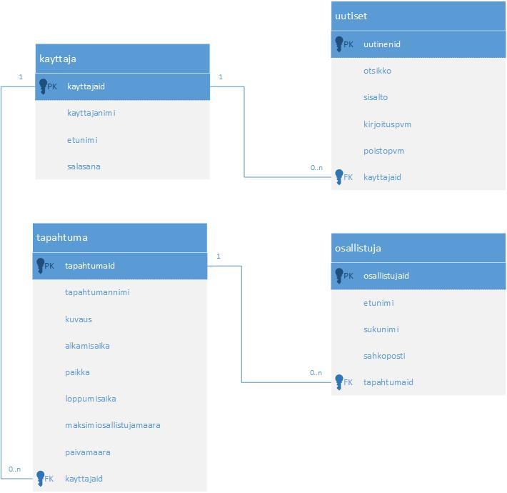

### Esitutkimus

Tehdään esitutkimus, jonka tarkoitus on määritellä tuote korkealla tasolla. Ymmärtää vaatimukset paremmin.

---
1. Käyttötapaukset

    Poimi järjestelmän toteutukselta vaaditut käyttötapaukset ja kokoa ne *UML use case* - malliksi.
    - Käyttötapaukset [UML use case](http://leeniemi.net/proj20AB/index.php?sivu=usecase)
    

2. Käyttöliittymäehdotus

    Tee karkea hahmotelma sivuston käyttöliittymäideasta tietokoneella sekä mobiililaitteella. Tee nopeasti muutama suuntaa-antava käyttöliittymäkuva AdobeXD-ohjelmalla (ei toimivaa navigointia, ei tarvitse olla kaikkia kenttiä vielä, eikä kaikkia näkymiä).
    - AdobeXD - prototyyppiharjoitus [ohje](http://www.leeniemi.net/syst19/index.php?sivu=xd), lataa kuvat [tästä](./img/xd_demo_kuvat.7z)

3. Käsitteanalyysi ja ER-diagrammi
     - Tee järjestelmään liittyvistä käsitteistä käsiteluettelo
     - Tee luettelon avulla järjestelmän [ER-malli](http://appro.mit.jyu.fi/tiedonhallinta/luennot/luento2/#TOC1)
     

4. Suunnittelu: tietokantasuunnitelma ja käyttöliittymän toiminnallinen suunnittelu

ER-mallin avulla luodaan tietokannan rakennetta kuvaava tietokantakaavio. Tietokantakaavioita on erilaisia (Crows foot, UML). Tässä UML-tietokantakaavioesimerkki:

    

Use case - diagrammin pohjalta suunnitellaan 
käyttöliittymän toiminta näyttörakennekaavion avulla:
    

5. Kokoa dokumentiksi

    Tee tiivis esitutkimusdokumentti, jossa kerrot:
    - Tuoteidean
    - Tuotteen taustan ja hyödyt
    - Tavoitteet ja vaatimukset (toiminnalliset vaatimukset, ei-toiminnalliset vaatimukset)
    - Projektin karkea aikataulu (8.1. 19.3. n.6h viikossa)

    Liitteiksi tulevat:
    - käyttötapauskaavio (UML use case)
    - käsitteistö ja ER-kaavio
    - käyttöliittymäehdotus (kevyt MockUP), liitä kuvina, lisää myös linkki MockUP:iin (HTML)
    - tietokantasuunnitelma (UML tai kukonaskel)
    - näyttörakennekaavio

    - esimerkkidokumentti [esitutkimuksesta](http://www.leeniemi.net/syst19/materiaali/WebMagiaEsitutkimus.pdf).

5. Vertaisarviointi

    Arvioi toisen opiskelijan tekemä esitutkimus, käytä tätä [pohjaa](http://www.leeniemi.net/syst19/materiaali/Vertaisarviointi.dotx)