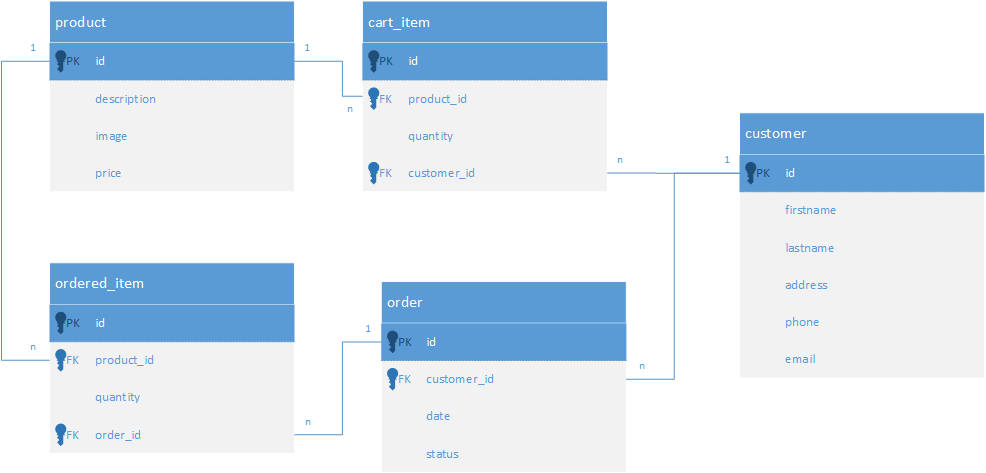

## REST API

Frontendin ja backendin välillä on ohjelmointirajapinta eli API (*Application Programming Interface*). Web-palvelut rakennetaan yleensä REST-rajapintaa käyttäen (*Representational State Transfer*). REST käyttää HTTP-protokollaa, data lähetetään JSON-muodossa ja resursseihin viitataan URI:en avulla (*Uniform Resource Identifier*).

### HTTP-metodit

*REST*:in toiminta perustuu siihen, että tietyillä HTTP-metodeilla saadaan aikaan tiettyjä toiminnallisuuksia:

- GET—metodin avulla haetaan tietty resurssi sen *id*:n avulla tai kokonainen kokoelma resursseja
- POST—metodin avulla luodaan uusi resurssi
- PUT—metodin avulla päivitetään resurssi sen *id*:n avulla
- DELETE—poistaa tietyn *id*:n

### Polut

*REST*-pyynnöt osoitetaan tiettyyn osoitteeseen. *REST*:in osoitteet on tarkoitettu helposti ymmärrettäviksi esim. http://myshopping.example.com/customer/23/orders/2, palauttaa asiakkaan nro 23 tilauksen nro 2.

### Paluuarvot

*REST*-pyyntöjen tulee palauttaa järkevä *HTTP*-paluuarvo. Niitä ei tule keksiä itse, vaan jokaiselle tilanteelle oma standardin mukainen koodinsa.

| Koodi  |     Kuvaus      |  Käyttö |
|----------|:-------------:|------:|
| 200 | OK | Pyyntö onnistui |
| 201 | Created   | Uusi resurssi luotiin onnistuneesti |
| 202 | Accepted | Pyyntö hyväksyttiin mutta sen suorittaminen kestää |
| 204 | No content | Pyyntö onnistui, mutta paluuarvoa ei lähetetä |
| 301 | Moved permanently | API on muuttunut ja pyyntö ohjataan uuteen osoiteeseen |
| 400 | Bad request | HTTP pyyntö on ollut puutteellinen |
| 401 | Unauthorized | Resurssin käyttö vaatii kirjautumisen |
| 403 | Forbidden | Suojattua resurssia on yritetty käyttää |
| 404 | Not found | Resurssia ei löydy |
| 500 | Internal server error | Palvelin virhe, josta ei voi toipua |

### Fanikaupan DB

Mallinnamme yksinkertaisen verkkokaupan tietokannan:




### Fanikaupan API (user)

| Metodi  |     URI      |  JSON server esimerkki | Kuvaus |
|----------|:-------------:|------:|------:|
| GET | products | http://localhost:3001/products | Paluttaa kaikki tuotteet |
| GET | products/:id | http://localhost:3001/products/1 | palauttaa tietyn tuotteen tiedot |
| GET | customers/:id/orders | http://localhost:3001/customers/2/orders | palauttaa tietyn asiakkaan kaikki tilaukset |
| GET | orders/:id | http://localhost:3001/orders/3 | palauttaa tietyn tilauksen tiedot |
| POST | customers | http://localhost:3001/customers | lisää uuden asiakkaan tiedot, annetaan JSON-muodossa |
| POST | orders | http://localhost:3001/orders | lisää uuden tilauksen tiedot, annetaan JSON-muodossa |
| PUT | orders/:id | http://localhost:3001/orders/3 | muuttaa tilauksen sisältöä, esim. status kenttää, annetaan JSON-muodossa |
| DELETE | orders/:id | http://localhost:3001/orders/3 | poistaa tilauksen |

### JSON-server

JSON serverin avulla voidaan toteuttaa yksinkertainen *REST*-API. Se tallentaa resurssit *json*-tiedostoon.

Tallenna [tämä](./json-fanikauppa.html) valmis resurssimäärittely tiedostoon *db.json*.

Asenna ja käynnistä JSON-serveri:

```cmd
npx json-server --port=3001 --watch db.json
```

### Postman

*REST*-rajapinnan testaaminen vaatii *REST*-client:in. Yksi sellainen on *Postman*. Asenna [*postman*-plugin](https://chrome.google.com/webstore/detail/postman/fhbjgbiflinjbdggehcddcbncdddomop?hl=sv) selaimeen ja testaa fanikaupan API:a sen avulla.

Postman:ia voi käyttää ilman tilin luomista mutta tilin avulla voidaan tallentaa API-kutsut, annetut parametrit sekä esimerkit palautuneesta datasta. Tätä voi käyttää eräänlaisena API-dokumentaationa projektityöskentelyssä.

Jotta voit tallentaa *HTTP*-kutsut luo ensin *collection*. Tee kutsut ja paina *save response* ja *save as example*. Lopuksi valitse *share collection* ja *collection link*.

[Linkki Postman-esimerkkeihin (vaatii Postman-pluginin)](https://www.getpostman.com/collections/15b27d53639e826c731e)


### Harjoituksia

#### Tehtävä 1

Lisää API:iin toiminnallisuus, joka toteuttaa ostonkorin (*cart*).

#### Tehtävä 2

Lisää API:iin *admin* toiminnallisuus, eli tuotetietojen lisääminen, poistaminen ja muokkaaminen.

### Tehtävä 3

Yhdistä *React*:illa koodaamasi frontend käyttämäämään tätä JSON-serveriä.

### Tehtävä 4

Lisää *admin* - toiminnallisuus frontendiin.

### Tehtävä 5

Suunnittele *REST API* vuokrausjärjestelmällesi.
